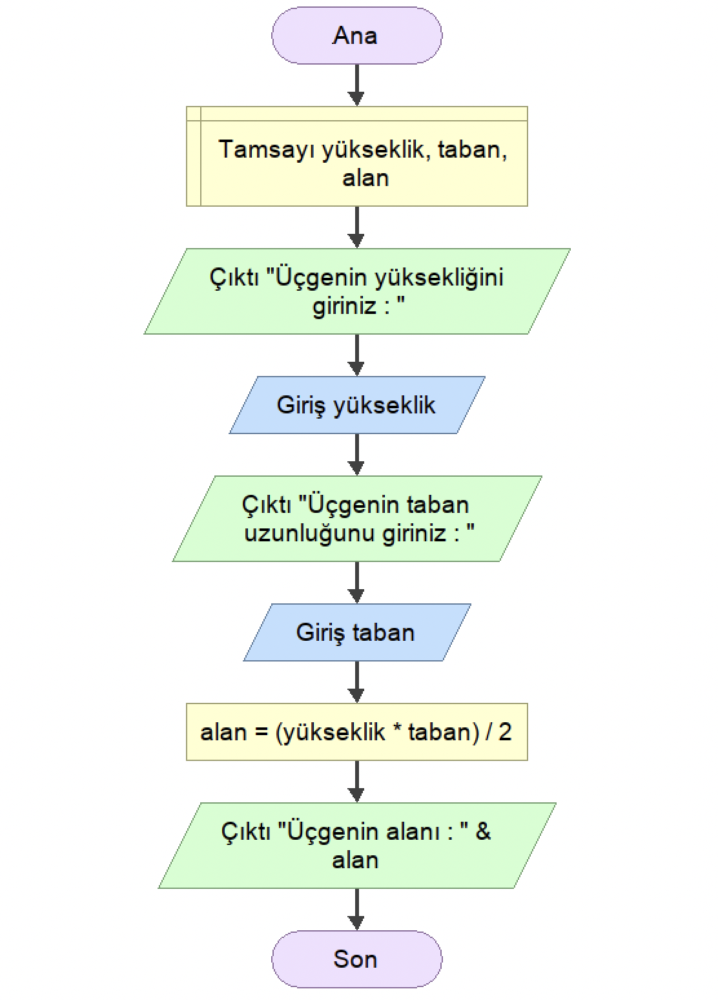

<h2 align="center">ÖRNEK 11</h2>

## 📌 Soru

    Yükseklik ve taban uzunluğu klaveden girilen üçgenin alanını hesaplayan uygulamanın akış diyagramını tasarlayınız.

## 📌 Akış Diyagramı

    

---

    

