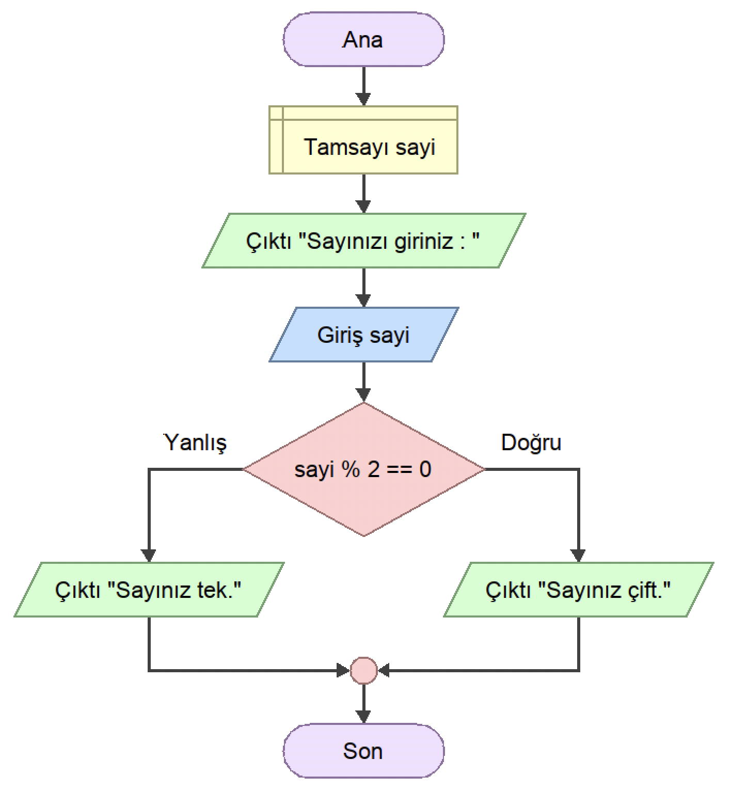

<h2 align="center">ÖRNEK 13</h2>

## 📌 Soru

    Kullanıcıdan alınan sayının tek ya da çift olduğunu kontrol edip ekranda yazdıran programın akış diyagramını tasarlayınız.

## 📌 Akış Diyagramı

    

---

    

