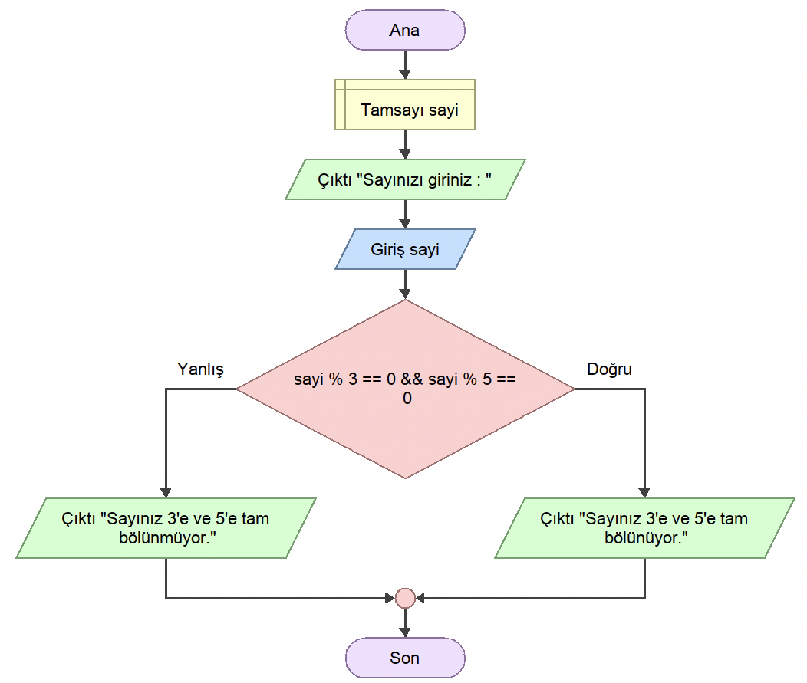

<h2 align="center">ÖRNEK 14</h2>

## 📌 Soru

    Kullanıcının klavyeden girdiği sayı 3’ e ve 5’ e tam bölünüyorsa ekrana tam bölünüyor yazan bölünmüyorsa bölünmüyor yazan programın akış diyagramını tasarlayınız.

## 📌 Akış Diyagramı

    

---

    

