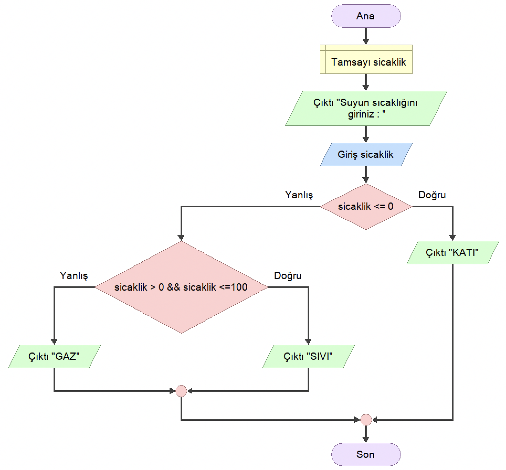

<h2 align="center">ÖRNEK 16</h2>

## 📌 Soru

    Suyun sıcaklık derecesine göre katı sıvı gaz halinde olduğu bulan ve ekrana yazan programın akış diyagramını tasarlayınız.

## 📌 Akış Diyagramı

    

---

    

