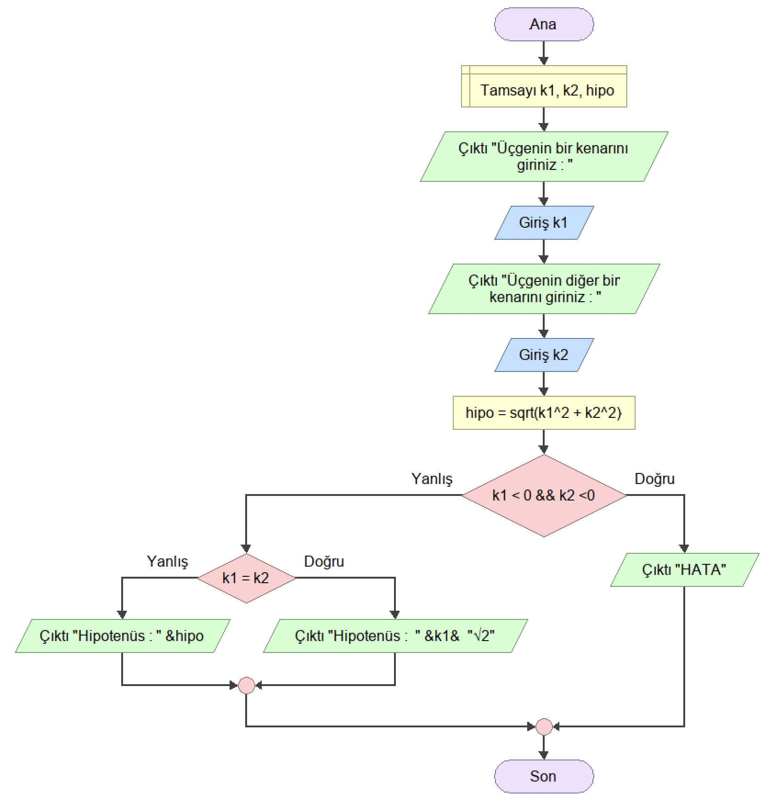

<h2 align="center">ÖRNEK 17</h2>

## 📌 Soru

    Dik Kenar Uzunlukları verilen dik üçgenin uzun kenar uzunluğunu (Hipotenüsü) bulan programın akış diyagramını tasarlayınız.

## 📌 Akış Diyagramı

    

---

    

