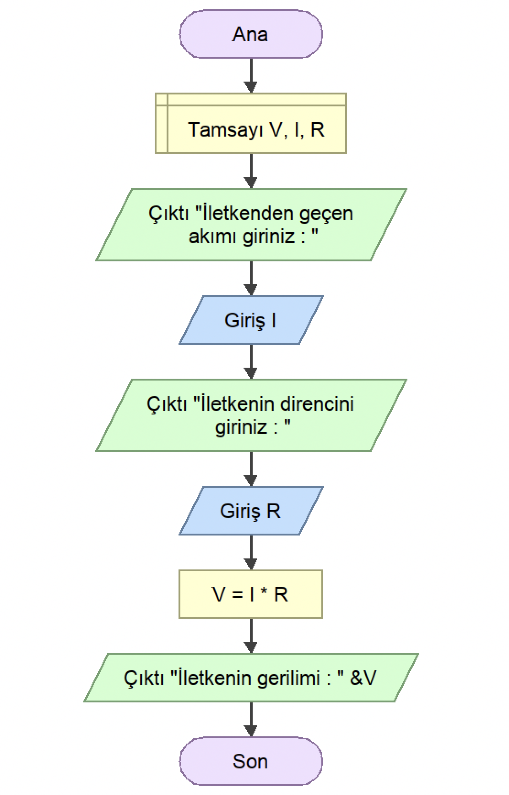

<h2 align="center">ÖRNEK 19</h2>

## 📌 Soru

    Bir iletkenin kutupları arasındaki gerilim (V) iletkenden geçen amper türünde akım (I) iletken üzerinde var olan direncin (R) çarpımına eşittir. V=I*R formülüyle gösterilir. Formülden faydalanarak kullanıcı tarafından girilen akım ve direnç değerlerine göre iletkenin kutupları arasındaki gerilimi hesaplayan programın akış diyagramını tasarlayınız.

## 📌 Akış Diyagramı

    

---

    

